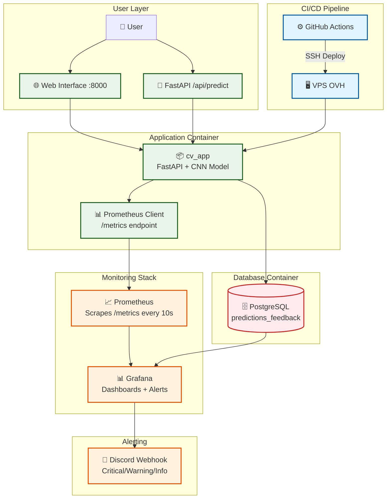

# 🐱🐶 Computer Vision Cats & Dogs - V3 MLOps

[](https://www.python.org)
[](https://fastapi.tiangolo.com/)
[](https://keras.io/)
[](https://www.postgresql.org/)
[](https://www.docker.com/)
[](https://prometheus.io/)
[](https://grafana.com/)
[](LICENSE)

<div align="center">

<h3>Système MLOps production-ready avec monitoring complet</h3>
<h3>Prometheus + Grafana + Discord + CI/CD automatisé</h3>

[Explore the docs](docs/) · [Architecture](#-architecture) · [Quick Start](#-quick-start)

</div>

---

## 📌 Introduction

**Version 3** du projet Computer Vision : transformation d'une application ML en système MLOps production-ready. Cette version ajoute un stack complet de monitoring (Prometheus + Grafana), alerting intelligent (Discord), containerisation (Docker), et déploiement automatisé (CI/CD).

### 🎯 Objectifs pédagogiques V3

- **Observabilité** : métriques Prometheus, dashboards Grafana, alertes proactives
- **Infrastructure as Code** : Docker Compose, provisioning automatique
- **CI/CD** : déploiement VPS automatisé via GitHub Actions
- **Production readiness** : healthchecks, rollback, monitoring multi-canal

## 🆕 Nouveautés V3

| Fonctionnalité | V2 | V3 |
|----------------|----|----|
| **Containerisation** | ❌ | ✅ Docker + Docker Compose |
| **Métriques** | Plotly dashboards | Prometheus + Plotly |
| **Visualisation** | Dashboards statiques | Grafana interactif + provisioning |
| **Alerting** | ❌ | Discord webhooks + Grafana Unified Alerting |
| **Déploiement** | Manuel | GitHub Actions → VPS |
| **Monitoring** | Base de données uniquement | PostgreSQL + Prometheus + logs |
| **Infrastructure** | Local | Production VPS (OVH) |

## 🏗️ Architecture MLOps

### 🛠️ Stack technologique complète

**Core Application** (conservé V2)
- **Dévelopement IA** : Keras 3 + TensorFlow (CNN)
- **Inférence IA** : ONNXRuntime 
- **API** : FastAPI avec authentification
- **Database** : PostgreSQL + SQLAlchemy
- **Frontend** : Jinja2 + Bootstrap 5

**🆕 MLOps Stack V3**
- **Gestion des dépendances** : Astral uv
- **Containerisation** : Docker + Docker Compose
- **Metrics** : Prometheus + prometheus-client
- **Dashboards** : Grafana + provisioning YAML
- **Alerting** : Discord webhooks + Grafana alerts
- **CI/CD** : GitHub Actions + SSH deployment
- **Infrastructure** : VPS OVH (production)

### 🔄 Architecture système


### 📁 Structure projet V3
```txt
computer-vision-cats-and-dogs-v3/
├── .github/
│   └── workflows/
│       └── deploy.yml              # 🆕 CI/CD automatique
├── config/                         # ✅ Inchangé
├── data/                           # ✅ Inchangé
├── docker/                         # 🆕 Nouvelle section
│   ├── docker-compose.yml          # Stack complète (app, db, monitoring)
│   ├── Dockerfile.app              # Image FastAPI + ML
│   ├── init-db.sql                 # Init PostgreSQL
│   └── .env                        # Secrets (gitignored)
├── monitoring/                     # 🆕 Configuration monitoring
│   ├── grafana/
│   │   └── provisioning/
│   │       ├── alerting/           # Alertes + contact points
│   │       ├── dashboards/         # Dashboards CV
│   │       └── datasources/        # Prometheus + PostgreSQL
│   └── prometheus/
│       ├── prometheus.yml          # Scrape configs
│       └── rules/                  # Alert rules (optionnel)
├── docs/
│   ├── MIGRATION_V2_TO_V3.md      # 🆕 Guide migration
│   └── MONITORING_SETUP.md        # 🆕 Setup Grafana/Discord
├── requirements/
│   ├── base.txt                    # ✅ Inchangé
│   ├── dev.txt                     # ✅ Inchangé
│   ├── prod.txt                    # 🆕 Ajout gunicorn
│   └── monitoring.txt              # 🆕 prometheus-client, psutil
├── src/
│   ├── api/                        # ✅ Conservé (routes enrichies)
│   ├── database/                   # ✅ Conservé
│   ├── models/                     # ✅ Conservé
│   ├── monitoring/
│   │   ├── dashboard_service.py    # ✅ Conservé (Plotly)
│   │   ├── prometheus_metrics.py   # 🆕 Export métriques
│   │   └── discord_notifier.py     # 🆕 Alertes Discord
│   └── web/                        # ✅ Conservé
├── tests/
│   ├── test_api_simple.py          # ✅ Conservé
│   ├── test_db_simple.py           # ✅ Conservé
│   ├── test_prometheus_metrics.py  # 🆕 Tests métriques
│   └── test_docker_health.py       # 🆕 Tests containers
├── .env.example                    # 🆕 Enrichi (Discord, Grafana)
└── README.md                       # 🆕 Ce fichier
```

## 📊 Stack de monitoring

### Prometheus (métriques)

**Métriques collectées** :
- `cv_predictions_total{result}` : Compteur prédictions (cat/dog)
- `cv_inference_time_seconds` : Histogram latence inférence
- `cv_model_confidence` : Histogram scores de confiance
- `cv_user_feedback_total{satisfaction}` : Compteur feedbacks
- `cv_database_connected` : Gauge statut DB (0/1)

**Endpoint** : http://localhost:9090

### Grafana (dashboards + alerting)

**Dashboards provisionnés** :
- KPIs temps réel (prédictions, latence, satisfaction)
- Time series inférence et feedbacks
- Statut infrastructure (DB, API)

**Alertes configurées** :
- 🔴 **Critical** : Database disconnected (rappel 5min)
- 🟡 **Warning** : High inference latency >2s (rappel 1h)
- 🔵 **Info** : No predictions activity 15min (rappel 6h)

**Endpoint** : http://localhost:3000 (admin/admin par défaut)

### Discord (notifications)

Notifications temps réel via webhook :
- Embeds riches avec métriques
- Couleurs par sévérité (rouge/jaune/bleu)
- Résolution automatique

## 🚀 Quick Start

### Prérequis

- Docker 24+ et Docker Compose 2+
- Git
- Make
- (Optionel) Astral uv pour développement local
- (Optionnel) VPS pour déploiement production

### Installation locale
```bash
# 1. Cloner le repository
git clone https://github.com/votre-username/computer-vision-cats-and-dogs-v3.git
cd computer-vision-cats-and-dogs-v3

# 2. Éditer .env avec vos valeurs (DB_PWD, API_TOKEN, DISCORD_WEBHOOK_URL, etc.)

# 3. Lancer la stack complète
make up

# 4. Vérifier les services
docker compose ps
```

### Accès aux services

- **Application** : http://localhost:8005
- **API Docs** : http://localhost:8005/docs
- **Monitoring V2** : http://localhost:8005/monitoring (Plotly)
- **Prometheus** : http://localhost:9095
- **Grafana** : http://localhost:3005 (admin/admin)

### Premier test
```bash
# Healthcheck
curl http://localhost:8005/health

# Prédiction (avec token)
curl -X POST http://localhost:8005/api/predict \
  -H "Authorization: Bearer VOTRE_TOKEN" \
  -F "file=@test_image.jpg" \
  -F "rgpd_consent=true"

# Métriques Prometheus
curl http://localhost:8005/metrics
```

## 🔧 Configuration

### Variables d'environnement (.env)
```bash
# Base de données
DB_HOST=postgres
DB_PORT=5432
DB_NAME=cats_dogs_db
DB_USER=catsdogs
DB_PWD=votre_mot_de_passe_securise
DB_TABLE_MONITORING=predictions_feedback

# API
API_TOKEN=votre_token_api_securise

# Monitoring V3
ENABLE_PROMETHEUS=true
DISCORD_WEBHOOK_URL=https://discord.com/api/webhooks/...

# Grafana
GRAFANA_ADMIN_USER=admin
GRAFANA_ADMIN_PASSWORD=changeme_en_production
```

### Setup Discord webhook

1. Discord → Paramètres serveur → Intégrations → Webhooks
2. Nouveau Webhook → Copier URL
3. Ajouter dans `.env` : `DISCORD_WEBHOOK_URL=...`

### Setup Grafana (automatique)

Le provisioning charge automatiquement :
- Datasources (Prometheus + PostgreSQL)
- Dashboards (CV monitoring)
- Contact points (Discord)
- Alert rules (DB, latency, activity)

**Personnalisation** : Modifier fichiers dans `monitoring/grafana/provisioning/`

## 🚢 Déploiement production

### Setup VPS (une fois)
```bash
# Sur le VPS
curl -fsSL https://get.docker.com | sh
mkdir -p ~/apps
cd ~/apps
nano .env  # Remplir secrets production
```

### Déploiement automatique (GitHub Actions)

1. **Configurer secrets GitHub** :
   - `SSH_PRIVATE_KEY` : Clé privée SSH
   - `VPS_HOST` : IP ou domaine VPS
   - `VPS_USER` : Utilisateur SSH
   - `GH_TOKEN` : Token GitHub (si repo privé)

2. **Push sur main** → déploiement automatique

Le workflow `.github/workflows/deploy.yml` :
- Clone le repo sur VPS
- Copie `.env` depuis `~/apps/.env`
- Rebuild images Docker
- Redémarre containers
- Nettoie images anciennes

### Rollback manuel
```bash
# Sur le VPS
cd ~/apps/computer-vision-cats-and-dogs-v3
git log --oneline  # Trouver commit précédent
git reset --hard <commit-hash>
cd docker
docker compose down && docker compose up -d --build
```

## 📈 Monitoring et alerting

### Métriques clés

**Performance** :
- Connection Postgres
- Latence P95 < 2s (SLA)
- Taux de confiance des prédictions (< 60%)
- Nombres de requêtes < 10000
- Taux de feedback négatifs (> 50 % )
- Taux de prédiction de la cible majoritaire (> 80%)  

**Business** :
- Volume prédictions
- Satisfaction utilisateur > 80%
- Répartition cats/dogs

**Infrastructure** :
- DB uptime > 99.9%
- Disk usage < 80%

### Alertes Discord

Les alertes sont envoyées automatiquement :
- **Critical** : notification immédiate + rappel 5min
- **Warning** : notification + rappel 1h
- **Info** : notification + rappel 6h

Configuration dans `monitoring/grafana/provisioning/alerting/`

## 🧪 Tests

### Tests locaux
```bash
# Tests unitaires
pytest tests/ -v

# Tests avec coverage
pytest tests/ --cov=src --cov-report=html

# Tests Docker
docker compose exec cv_app pytest tests/
```

### Tests CI/CD (automatiques)

GitHub Actions exécute :
- Tests API avec DB PostgreSQL
- Tests métriques Prometheus
- Healthchecks Docker

## 🔌 API Endpoints (V3)

### Nouveaux endpoints

- `GET /health` : Healthcheck étendu (DB + model + monitoring status)
- `GET /metrics` : Export Prometheus (si `ENABLE_PROMETHEUS=true`)

### Endpoints conservés V2

- `POST /api/predict` : Prédiction + tracking Prometheus
- `POST /api/update-feedback` : Feedback + tracking
- `GET /api/statistics` : Stats globales
- `GET /monitoring` : Dashboard Plotly (+ liens Grafana/Prometheus)

## 📚 Documentation

- [MIGRATION_V2_TO_V3.md](docs/MIGRATION_V2_TO_V3.md) : Guide migration depuis V2
- [MONITORING_SETUP.md](docs/MONITORING_SETUP.md) : Configuration monitoring avancée
- Code source : Commentaires pédagogiques enrichis dans tous les fichiers

## 🎓 Concepts MLOps illustrés

- **Observability** : logs + métriques + traces (partiel)
- **Infrastructure as Code** : Docker Compose + provisioning
- **GitOps** : configuration versionnée (Grafana dashboards)
- **Continuous Deployment** : GitHub Actions → VPS
- **Monitoring multi-niveau** : application + infrastructure
- **Alerting intelligent** : seuils adaptatifs + grouping

## 🛣️ Roadmap

**V3 actuel** : MLOps core (monitoring, alerting, CI/CD)

**Évolutions futures** :
- Model versioning (MLflow, DVC)
- A/B testing infrastructure
- Feature store (Feast)
- Advanced observability (OpenTelemetry, distributed tracing)
- Kubernetes deployment
- Auto-scaling

## 📄 Licence

MIT - Projet éducatif à des fins pédagogiques

## 🤝 Contributions

Projet pédagogique. Contributions bienvenues pour :
- Améliorer clarté documentation
- Ajouter exemples concrets
- Enrichir tests
- Proposer nouveaux cas d'usage MLOps

---

**Version** : 3.0.0  
**Status** : Production-ready (démonstration pédagogique)  
**Stack** : FastAPI + PostgreSQL + Prometheus + Grafana + Docker + CI/CD  
**Next** : Model lifecycle management avancé